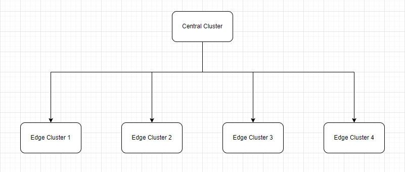

# Smart City

(KCP-21) PoC with the Edge computing aspects and hierarchical dependencies

Authors: 

- Konrad Czerepak
- Zofia Grodecka
- Przemysław Rożnawski
- Maciej Zieliński

Year: 2023 \
Group: 4

## Table of content

[1. Introduction](#introduction) \
[2. Theoretical background and technology stack](#theoretical-background-and-technology-stack) \
[3. Case study concept description ](#case-study-concept-description) \
[4. Solution architecture](#solution-architecture) \
[5. Environment configuration description](#environment-configuration-description) \
[6. Installation method](#installation-method) \
[7. How to reproduce](#how-to-reproduce) \
&ensp; [7.1 Infrastructure as Code approach](#infrastructure-as-code-approach) \
[8. Demo deployment steps](#demo-deployment-steps) \
&ensp; [8.1 Configuration set-up](#configuration-set-up) \
&ensp; [8.2 Data preparation](#data-preparation) \
&ensp; [8.3 Execution procedure](#execution-procedure) \
&ensp; [8.4 Results presentation](#results-presentation) \
[9. Summary](#summary) \
[10. References](#references) 

<!-- toc -->

## Introduction

Kubernetes is a powerful and popular open-source container orchestration platform that has gained significant traction in recent years due to its ability to simplify the deployment and management of containerized applications. However, as the adoption of Kubernetes continues to grow, so do the challenges associated with managing and securing Kubernetes clusters at scale.

One of the emerging needs in the Kubernetes ecosystem is for Kubernetes Control Plane (KCP) solutions. KCP solutions provide an additional layer of security and manageability to Kubernetes clusters by enabling administrators to monitor, audit, and secure the Kubernetes control plane components. This is critical because the control plane components of Kubernetes are responsible for managing the entire cluster and any vulnerabilities or breaches can lead to significant consequences.

KCP solutions offer several benefits, including enhanced visibility into the Kubernetes control plane, increased security, simplified management, and improved compliance. As more organizations adopt Kubernetes, KCP solutions are becoming essential for enterprises to manage and secure their Kubernetes clusters effectively.

In this context, this emerging need for KCP Kubernetes is driving the development of innovative solutions and tools that help enterprises ensure the stability and reliability of their Kubernetes deployments while maintaining security and compliance.

## Theoretical background and technology stack

Containerization is a technology that enables developers to package applications and their dependencies into a single container that can run consistently across different environments. This makes it easier to deploy and manage applications, as they can be deployed as isolated units and easily moved between environments.

Kubernetes is an open-source container orchestration platform that provides a consistent and uniform platform for deploying and managing containerized applications. Kubernetes provides features such as automatic scaling, self-healing, and rolling updates, making it an ideal platform for deploying and managing complex applications.

Kubernetes Control Plane (KCP) is a control plane that is similar to Kubernetes but with a focus on enabling the creation of many independent, isolated "clusters" called workspaces. KCP provides a centralized platform for offering APIs that can be consumed easily by users in their workspaces, and enables flexible scheduling of workloads to physical clusters and transparent movement of workloads among compatible physical clusters.

In terms of the technology stack for this project, we will be using containerization technologies such as Docker and Kubernetes to package and deploy the different components of the system. We will also be using KCP to manage the Kubernetes control plane components, and to enable fine-grained access controls and network segmentation to ensure the security of the system.

For the microservices that handle city data, we will be using Java as the programming language. Java is a popular programming language for building microservices due to its platform independence, robustness, and scalability. We may also use other technologies such as Spring Boot or MicroProfile to facilitate the development of the microservices.

## Case study concept description 

In this case study, we will explore how Kubernetes Control Plane (KCP) can be used to manage a system that mimics a smart city. Specifically, we will focus on how the system can be designed to run on different underlying hardware architectures, while also ensuring the security of the entire system.

The smart city system is designed to collect data from various sensors placed around the city. The system follows a distributed architecture where edge clusters are responsible for collecting and storing data from sensors within their respective areas. These edge clusters aggregate the collected data and forward it to a central server for processing and analysis. The central cluster is responsible for collecting data from the entire city and making it available to users, enabling quick access to data from a selected location. This approach allows for efficient data management and reduces the load on the central server and by utilizing edge servers, the system can minimize latency and ensure quick operations without the need to transfer data to the main server, ultimately improving efficiency and responsiveness.

The sensor capabilities include:

- Air Pollution Monitoring: The smart city system utilizes pollution sensors to measure air quality in various locations throughout the city. These sensors continuously monitor the levels of pollutants in the air, such as particulate matter, nitrogen dioxide, and ozone. 

- Traffic Management: The pollution sensors can also be used to manage traffic in the city. These sensors collect data on traffic flow, congestion levels, and road occupancy. By analyzing this real-time data, the system can identify areas with heavy traffic and adjust the traffic flow accordingly.

- Alerting Citizens: The smart city system is equipped with sensors that enable rapid alerting of citizens in urgent situations. These sensors can detect critical events such as fires, natural disasters, or security breaches. When such events occur, the system immediately triggers alerts to notify citizens and provide them with relevant information and instructions to ensure their safety.

- Self-driving Cars: The smart city system incorporates sensors that detect the proximity of objects around self-driving cars, including other vehicles, bicycles, and pedestrians. These sensors continuously monitor the environment, allowing the system to quickly assess potential dangers and react accordingly.

- Parking Space Updates: The system can offer real-time updates on available parking spaces near the sensors. By monitoring parking spaces in proximity to the sensors, the system can inform drivers about the availability of free parking spaces. This feature optimizes traffic flow by reducing the time spent searching for parking spots.

We will use containerization technologies, such as Docker and Kubernetes, to package and deploy the different components of the system. The container images will be designed to be architecture-agnostic, allowing them to run on different hardware architectures.

Kubernetes will be used to manage the different components of the system, such as the edge clusters and the central server. Kubernetes provides a consistent and uniform platform for managing the different components, regardless of the underlying hardware architecture.

With KCP, we will be able to monitor and manage the Kubernetes control plane components, ensuring that the system operates at optimal performance levels. KCP will also enable fine-grained access controls and network segmentation to ensure the security of the system.

Overall, this case study demonstrates how Kubernetes Control Plane (KCP) solutions can effectively manage a smart city system running on different underlying hardware architectures while prioritizing security. By leveraging containerization technologies, Kubernetes, and KCP, the system abstracts away the complexities of the underlying hardware, providing a consistent and uniform platform for deploying and managing the system.

Furthermore, by utilizing edge servers, the system minimizes latency and ensures quick operations without the need to transfer data to the main server. This optimization enables faster execution of tasks such as alerting citizens about urgent situations, providing real-time updates on parking availability, dynamically managing traffic flow, and assisting self-driving cars. The utilization of edge servers enhances the overall responsiveness of the system, improving efficiency and user experiences.

## Solution architecture

In order to carry out the Demo, we plan to simulate the air quality control system presented earlier using Kubernetes clusters with the help of Kubernetes Control Plane.

We anticipate a hierarchical cluster architecture, where the main service providing data to users has access to all services running on edge clusters in order to access their data.

By using KCP, communication between clusters will be done through a simple API.

Each of the clusters will have a main service (central cluster) and edge services (edge clusters) that will be created using Java and Spring. They will be simple services designed to simulate the operation of a real smart city for the purpose of demonstrating the use of KCP.

## Environment configuration description

To create a Demo application using Java Spring and Kubernetes KCP, several tools need to be installed and configured on the local machine. 

The main tools required for the application are the Kubernetes command-line interface, called kubectl, and the Kubernetes control plane (KCP) tool. Kubectl is a command-line tool used to deploy and manage applications on a Kubernetes cluster. It provides a simple and intuitive way to interact with the Kubernetes cluster and manage the whole application. KCP is a tool used to manage the Kubernetes control plane components, such as the API server, or scheduler. It provides a centralized view of the Kubernetes control plane and enables a user to manage and monitor the control plane components. In addition to kubectl and KCP, it is required to have a local Kubernetes cluster to deploy and manage microservices. In this case, we will use Minikube, which is a tool that allows us to run a single-node Kubernetes cluster on our local machine. Minikube is easy to set up and provides a lightweight and portable way to test microservices locally. To package our microservices and dependencies into a container image, we will need to use Docker, which is a popular containerization platform that enables users to package their applications and dependencies into a container image. Finally, to develop and implement our proper microservices using Java and SpringBoot, we will need the Java Development Kit (JDK) to compile the Java code, and Apache Maven to manage dependencies and build the application.

By installing and configuring all of these tools on your local machine, you can create and deploy a microservice application using Java Spring and Kubernetes KCP.

## Installation method

## How to reproduce

### Infrastructure as Code approach

## Demo deployment steps

### Configuration set-up

### Data preparation

### Execution procedure

### Results presentation

## Summary

## References
