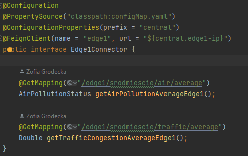

Aktualnie pliki gotwoe do postawienia klastra są dla central-serrvice (Dockerfile, k8s.yaml)

Poradnik: https://www.fullstackbook.com/devops/how-to-deploy-spring-boot-with-amazon-eks/

Aby odplaić u siebie klaster z postawionym obrazem dokerowym modułu netral-service trzeba:
- stworzyć jar z modułu central-service (maven)
- w pliku Dockerfile podmienić jar na swój
- stworzenie obrazu dokerowego: "docker build -t myapp ." (myapp to nazwa, mzona inne dąc :)
- stworzenie repo i dodanie obrazu zgodnie z poradnikiem
- stworzenie klastra (korzystajac z EKS jak na labach)
- stworzenie node_group (byle jaka, w klastrze)
- dwie komendy: "aws eks describe-cluster --region us-east-1 --name <your cluster> --query cluster.status" 
  "aws eks --region us-east-1 update-kubeconfig --name <your cluster>"
- w pliku k8s.yaml trzeba podmienić image:____ na to co znajdziemy w naszym stworzonym wczesniej repo (klikamy Copy URI)

 Memory celowo ustawiona na 1Gi, porty wszedzie ustawione na zgodne z application.properties -> server.port
- komenda do stwrozenia poda: kubectl apply -f k8s.yaml
- z komendy "kubectl get svc" kopiujemy External-IP naszego myapp i w przegląarce mozna zoabczyć HelloWorld, jeśli wejdziemy na:
  <<External-IP>>:8250/central/data/