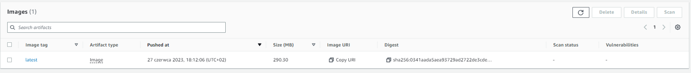

Aktualnie pliki gotowe do postawienia klastra są dla central-service (Dockerfile, k8s.yaml)

Poradnik: https://www.fullstackbook.com/devops/how-to-deploy-spring-boot-with-amazon-eks/


# Jak uruchomić u siebie klaster z działającym na nim spring boot serwisem?

## Stworzenie klastra i node grupy

To trzeba zrobić tak jak na labach. Najlepiej przez konsolę AWS, przez CLI pojawiają się problemy z uprawnieniami.

Przy tworzeniu ustawiamy wszystko na default.
Jeśli pojawi się problem z tworzeniem klastra, poprawiamy subnety, pozbywając się tych które nie działają.

W czasie kiedy tworzy się cluster i node grupa można przejść do następnych kroków.

## Budowanie projektu

Stwórz zbudowany serwis w formacie .jar korzystając z mavena, np. tak:

(W głównym folderze serwisu)
```
mvn clean package
```

## Tworzenie obrazka dokerowego

`Dockerfile` powinien wyglądać tak:

```
FROM openjdk:17
WORKDIR /usr/src/central-service
COPY target/central-service-0.0.1-SNAPSHOT.jar /usr/src/central-service
CMD ["java", "-jar", "/usr/src/central-service/central-service-0.0.1-SNAPSHOT.jar"]
```

Dla central-service jest już stworzony. Można podmienić plik .jar na swój, aczkolwiek ścieżka powinna być taka sama.


## Stworzenie repo i dodanie obrazka

Robimy to tak, jak w instrukcji pod linkiem:

### Elastic Container Registry (ECR) Setup
- Go to Amazon ECR.
- Create a repository.
- Click on "View push commands".
- Follow the instructions to push image.
- Copy the image url.

W tym kroku trzeba zbudować u siebie obrazek Dockerowy serwisu i wrzucić go na AWS Elastic Container Registry (EKR).


## Sprawdzamy, czy klaster stoi i jest gites

W następnym kroku będziemy tworzyć w tym clustrze poda.

```
aws eks describe-cluster --region us-east-1 --name <your cluster> --query cluster.status
```

Nie wiem co to robi, ale trzeba puścić bo potem nie zadziała:
```
aws eks --region us-east-1 update-kubeconfig --name mein-cluster
```

## Tworzymy i uruchamiamy poda z naszym serwisem

Pod będzie działać w stworzonym clustrze, korzystając z jednego z nodeów w naszej node grupie.

Configurację poda tworzymy w pliku `k8s.yaml`.
Można wzorować się na tej stworzonej dla `central-service`.

W konfiguracji podajemy obrazek Dockerowy, z którego będzie startowany pod.
Musi to być obrazek, który właśnie wrzuciliśmy na EKR.

Aby zdobyć link do obrazka, wchodzimy do naszego repozytorium EKR i przy obrazku klikamy "Copy URI", które wklejamy do configu.


W konfiguracji warto zwrócić uwagę na mapowanie portów oraz przydzielone zasoby CPU i Memory.
128 MB to na pewno za mało :p.


Startujemy poda korzystając z konfiguracji:

```
kubectl apply -f k8s.yaml
```

Możemy sprawdzić jego status:
```
kubectl get pod
```
Czekamy, aż status będzie `Running`.

Następnie możemy wylistować serwisy:
```
kubectl get svc
```

Stąd mamy `EXTERNAL-IP` naszego LoadBalancera.
Możemy uderzyć na niego z przeglądarki i zobaczyć "Hello World" (dla central cluster):

```
<<External-IP>>:8250/central/data/
```
